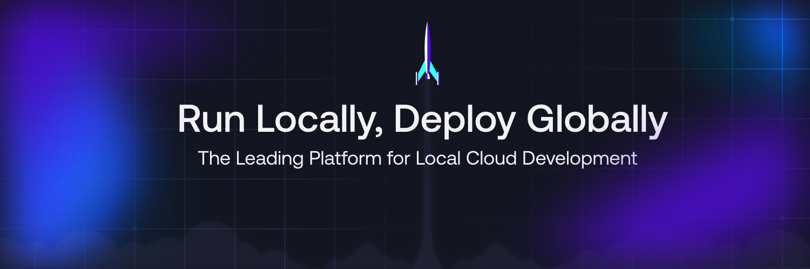

> [!NOTE]
> **TotalStack — A LocalStack Fork for Local AWS Development**
>
> TotalStack is an actively maintained fork of LocalStack, focused on providing a fully functional local AWS cloud stack for development and testing. It emulates AWS services (S3, Lambda, DynamoDB, EC2, IAM, CloudFormation, and many more) in Docker, providing AWS-compatible APIs locally.
>
> **Key differences from upstream LocalStack:**
>
> - **Active development** — This is not an archived repository. TotalStack receives regular updates, bug fixes, and service improvements.
> - **Spec-driven development** — Services are implemented against auto-generated API specs from AWS botocore service models, ensuring parity with real AWS behavior.
> - **TotalStack-specific services** — Custom TotalStack service layer on top of LocalStack core with enhanced state management, error handling, and test coverage.
> - **CI-driven quality** — Validated services — acm, dynamodbstreams, s3tables, transcribe — are tested against recorded real-AWS behavior; remaining TotalStack providers fall back to Moto.
>
> This project builds on the incredible work of the LocalStack team and community. See [ACKNOWLEDGMENTS](docs/ACKNOWLEDGMENTS.md) for attribution.

<p align="center">
  
</p>

<p align="center">
  <a href="https://github.com/totalwindupflightsystems/totalstack/actions/workflows/ci.yml"></a>
  <a href="https://github.com/psf/black"></a>
  <a href="https://github.com/astral-sh/ruff"></a>
  <a href="https://bsky.app/profile/localstack.cloud"></a>
</p>

<p align="center">
  LocalStack is a cloud software development framework to develop and test your AWS applications locally.
</p>

<p align="center">
  <a href="#overview">Overview</a> •
  <a href="#install">Install</a> •
  <a href="#quickstart">Quickstart</a> •
  <a href="#running">Run</a> •
  <a href="#usage">Usage</a> •
  <a href="#releases">Releases</a> •
  <a href="#contributing">Contributing</a>
  <br/>
  <a href="docs/API.md">📖 API docs</a> •
  <a href="docs/README.md">📚 Dev docs</a> •
  <a href="https://docs.localstack.cloud" target="_blank">📖 Docs</a> •
  <a href="https://www.localstack.cloud/localstack-for-aws" target="_blank">💻 LocalStack for AWS</a> •
  <a href="#totalstack-providers">☑️ LocalStack coverage</a>
</p>

---

# Overview

[TotalStack](https://github.com/totalwindupflightsystems/totalstack) is a cloud service emulator that runs in a single container on your laptop or in your CI environment. With TotalStack, you can run your AWS applications or Lambdas entirely on your local machine without connecting to a remote cloud provider! Whether you are testing complex CDK applications or Terraform configurations, or just beginning to learn about AWS services, TotalStack helps speed up and simplify your testing and development workflow.

TotalStack is a fork of [LocalStack](https://localstack.cloud), maintaining compatibility with the LocalStack CLI and Docker images while adding TotalStack-specific service implementations, enhanced error handling, and spec-driven development.

TotalStack supports a growing number of AWS services, like AWS Lambda, S3, DynamoDB, Kinesis, SQS, SNS, and many more! You can find a comprehensive list of supported APIs on our [☑️ Feature Coverage](https://docs.localstack.cloud/user-guide/aws/feature-coverage/) page (upstream LocalStack docs).

LocalStack also provides additional features to make your life as a cloud developer easier! Check out LocalStack's [User Guides](https://docs.localstack.cloud/user-guide/) for more information.

## Install

> **TotalStack fork note:** this repository **is** the emulator. There is no
> pip-installable `totalstack` package and the fork does not publish a
> pre-built Docker image yet — the supported way to run TotalStack is a
> checkout-based install from this repository.

The quickest way to get started with TotalStack is to install it from a
checkout:

```bash
git clone https://github.com/totalwindupflightsystems/totalstack.git
cd totalstack
make install-test   # creates .venv/, installs runtime + test deps, wires the awslocal wrapper
make start          # boots the emulator in-memory on http://localhost:4566
```

`make install-test` creates the project virtual environment and installs
everything needed to run and test the emulator, including the `awslocal` CLI —
a TotalStack preflight wrapper that forces traffic to `localhost:4566` even
when `AWS_ENDPOINT_URL` or `AWS_PROFILE` are set in your environment.

Alternatively, install the package in editable mode from the checkout:

```bash
pip install -e .
```

> **Upstream note:** the upstream LocalStack CLI (the `localstack` package on
> PyPI) and its Docker-image workflow target upstream LocalStack, **not** this
> fork. The fork's Docker workflows build the image from source — see
> [DOCKER.md](DOCKER.md).

## Quickstart

TotalStack is a fork of LocalStack and runs the emulator itself. The
recommended entry point for development and testing is `make start`, which
boots the emulator **in-memory** (no Docker required) on `http://localhost:4566`:

```bash
# from the repository root (first time: make install-test)
make start
```

> **Note**: `make install-test` also installs the `awslocal` CLI (from the
> `awscli-local` package) into the project venv — and wires the TotalStack
> preflight wrapper (`scripts/awslocal`) in as `.venv/bin/awslocal`, so the
> examples below are safe by default. Activate the venv (`source
> .venv/bin/activate`) or use `.venv/bin/awslocal` directly.
>
> **Note**: `awslocal` targets `http://localhost:4566` by default, but ambient
> AWS environment variables silently override that default. If
> `AWS_ENDPOINT_URL` (or `AWS_ENDPOINT_URL_<SERVICE>`), `AWS_PROFILE` or
> `AWS_DEFAULT_PROFILE` are set — e.g. for other cloud tooling on the same
> machine — `awslocal` can route requests to that endpoint instead of the
> local emulator (a real-cloud traffic leak risk). The venv `awslocal`
> installed by `make install-test` is the TotalStack preflight wrapper: it
> warns about such conflicts and forces the local endpoint (the upstream
> binary is kept as `.venv/bin/awslocal-upstream`). If you run a bare
> `awslocal` from elsewhere (system install, other venv), use the wrapper via
> `scripts/awslocal` or unset those variables before invoking `awslocal`.

> **Note**: On non-root boots `make start` skips the DNS server (it needs a
> privileged port; the boot log shows `totalstack: non-root boot — DNS server
> disabled (DNS_ADDRESS=0)` instead of an error). The `cbor2 patching
> disabled` warning in the boot log is benign — it only means Kinesis CBOR
> datetime encoding may use seconds instead of milliseconds.

### Lambda handlers: endpoint rule (important)

> **Note**: inside Lambda, the emulator is reached via the injected
> `AWS_ENDPOINT_URL` (the docker bridge gateway, e.g.
> `http://172.17.0.1:4566`) — `localhost:4566` does NOT resolve in the
> container. Handlers must use `os.environ["AWS_ENDPOINT_URL"]` or plain boto3
> with no `endpoint_url`. NEVER hardcode `endpoint_url='http://localhost:4566'`
> inside a handler.

```python
# ✅ working (either):
import os, boto3
ddb = boto3.resource("dynamodb", region_name="us-east-1")  # picks up injected AWS_ENDPOINT_URL
ddb = boto3.resource("dynamodb", endpoint_url=os.environ["AWS_ENDPOINT_URL"], region_name="us-east-1")

# ❌ broken — EndpointConnectionError; lambda.invoke still returns HTTP 200 with
#    the error hidden in the payload ("errorType": "EndpointConnectionError"),
#    so the failure is easy to miss:
ddb = boto3.resource("dynamodb", endpoint_url="http://localhost:4566", region_name="us-east-1")
```

For the full S3 → Lambda → DynamoDB walkthrough (IAM role, table, bucket
notification, 1.1s roundtrip), see
[docs/dogfood/2026-08-25-integration.md](docs/dogfood/2026-08-25-integration.md).

### Lambda handlers: event-source deliveries after code updates (important)

> **Note**: `update_function_code` triggers an asynchronous version
> rollover — the old execution environment is stopped and an in-flight
> event-source invocation is cancelled (`CancelledError` in the boot log).
> Events are re-queued and delivered later against the new version, but the
> first delivery after an update can be delayed minutes. After
> `update_function_code`, wait for `State == "Active"` AND
> `LastUpdateStatus == "Successful"` before expecting reliable event
> deliveries, keep handlers idempotent, and poll sinks ≥60s before
> concluding an event was lost. Details:
> [docs/dogfood/2026-08-27-lambda-update-race.md](docs/dogfood/2026-08-27-lambda-update-race.md).

You can query the status of respective services on the running emulator with
the same commands as LocalStack (via the `awslocal` CLI or plain boto3 against
the local endpoint):

```bash
curl -s localhost:4566/_localstack/health
```

### Persistence

> **⚠️ `make start` runs the emulator **in-memory**: all state (SQS queues,
> S3 buckets and objects, DynamoDB tables, Lambda functions, CloudFormation
> stacks, …) is **lost when the emulator stops or restarts** — including
> `Ctrl-C` and machine reboots. `make start` prints a one-line reminder of
> this on every boot. There is no on-disk persistence for the in-memory
> workflow.

If you need state to survive restarts, use the Docker workflow
([DOCKER.md](DOCKER.md)): the docker-compose example mounts
`${LOCALSTACK_VOLUME_DIR:-./volume}:/var/lib/localstack`, which persists the
emulator's state directory across container restarts. Note that the
in-memory mode is the recommended default for development and testing — most
workflows create their fixtures (queues, buckets, tables) programmatically at
startup anyway.

### Docker

If you prefer running TotalStack in Docker, see [DOCKER.md](DOCKER.md) for the
container-based workflow.

To use SQS, a fully managed distributed message queuing service, on LocalStack, run:

```shell
% awslocal sqs create-queue --queue-name sample-queue
{
    "QueueUrl": "http://sqs.us-east-1.localhost.localstack.cloud:4566/000000000000/sample-queue"
}
```

Learn more about [LocalStack AWS services](#core-services-localstack-core) and using them with LocalStack's `awslocal` CLI.

## Running

TotalStack is not a pip-installable CLI and does not publish a pre-built
image — the only supported ways to run it are from this repository:

- **In-memory (`make start`)** — the fastest way to run the emulator; no
  Docker required. See [Quickstart](#quickstart).
- **Docker (build from source)** — build the image from this repository's
  `Dockerfile` and run it:

  ```bash
  docker build -t totalstack .
  docker run --rm -it -p 4566:4566 -p 4510-4559:4510-4559 totalstack
  ```

  Full details (Compose, rebuilds, configuration) in [DOCKER.md](DOCKER.md).

The upstream LocalStack install options (upstream CLI, published Docker
image, Docker Compose, Helm) target upstream LocalStack, NOT this fork, and
are **not applicable** here.

## Usage

For TotalStack-specific API and integration guidance, see [API docs](docs/API.md); for developer documentation, see [Developer docs](docs/README.md).

To start using LocalStack, check out our [documentation](https://docs.localstack.cloud).

- [LocalStack Configuration](https://docs.localstack.cloud/references/configuration/)
- [LocalStack in CI](https://docs.localstack.cloud/user-guide/ci/)
- [LocalStack Integrations](https://docs.localstack.cloud/user-guide/integrations/)
- [LocalStack Tools](https://docs.localstack.cloud/user-guide/tools/)
- [Understanding LocalStack](https://docs.localstack.cloud/references/)
- [Frequently Asked Questions](https://docs.localstack.cloud/getting-started/faq/)

To use LocalStack with a graphical user interface, you can use the following UI clients:

- [LocalStack Web Application](https://app.localstack.cloud)
- [LocalStack Desktop](https://docs.localstack.cloud/user-guide/tools/localstack-desktop/)
- [LocalStack Docker Extension](https://docs.localstack.cloud/user-guide/tools/localstack-docker-extension/)

### Core services (localstack-core)

The headline AWS services (S3, Lambda, DynamoDB, EC2, IAM, CloudFormation) are
implemented in LocalStack core — not by TotalStack providers:

- **s3** — `localstack-core/localstack/services/s3/`
- **lambda** — `localstack-core/localstack/services/lambda_/` (core directory is `lambda_`)
- **dynamodb** — `localstack-core/localstack/services/dynamodb/`
- **ec2** — `localstack-core/localstack/services/ec2/`
- **iam** — `localstack-core/localstack/services/iam/`
- **cloudformation** — `localstack-core/localstack/services/cloudformation/`

Each has a same-name integration-test suite under `tests/aws/services/`. These six
are implemented in `localstack-core/` and are NOT part of the 69-service
TotalStack-provider table below.

## TotalStack providers

TotalStack emulates 69 AWS services. Each service ships a TotalStack provider under
`totalstack/services/<service>/`, auto-wired from the Speclang specs
(`specs/aws/.speclang/assembled/`) and dispatched through `MotoFallbackDispatcher` -
operations not handled by the local provider fall back to Moto. Only 4 of the 69
services currently have a same-name integration-test suite under `tests/aws/services/`;
the other 65 have no direct integration tests, so the code layout alone does not show
which services are exercised by tests and which rely on the Moto fallback.

| Service | Integration tests | Status |
|---|---|---|
| acm | :white_check_mark: | tested |
| amp |  | Moto fallback |
| amplify |  | Moto fallback |
| appconfig |  | Moto fallback |
| application-autoscaling |  | Moto fallback |
| appmesh |  | Moto fallback |
| appsync |  | Moto fallback |
| athena |  | Moto fallback |
| autoscaling |  | Moto fallback |
| backup |  | Moto fallback |
| batch |  | Moto fallback |
| bedrock |  | Moto fallback |
| bedrock-agent |  | Moto fallback |
| bedrock-runtime |  | Moto fallback |
| cloudfront |  | Moto fallback |
| cloudtrail |  | Moto fallback |
| codeartifact |  | Moto fallback |
| codebuild |  | Moto fallback |
| codedeploy |  | Moto fallback |
| codepipeline |  | Moto fallback |
| cognito-identity |  | Moto fallback |
| comprehend |  | Moto fallback |
| datasync |  | Moto fallback |
| dms |  | Moto fallback |
| docdb |  | Moto fallback |
| dynamodbstreams | :white_check_mark: | tested |
| ecr |  | Moto fallback |
| efs |  | Moto fallback |
| fis |  | Moto fallback |
| forecast |  | Moto fallback |
| frauddetector |  | Moto fallback |
| fsx |  | Moto fallback |
| globalaccelerator |  | Moto fallback |
| grafana |  | Moto fallback |
| greengrassv2 |  | Moto fallback |
| identitystore |  | Moto fallback |
| iot |  | Moto fallback |
| iot-data |  | Moto fallback |
| kendra |  | Moto fallback |
| keyspaces |  | Moto fallback |
| lexv2-models |  | Moto fallback |
| lexv2-runtime |  | Moto fallback |
| lightsail |  | Moto fallback |
| mediaconvert |  | Moto fallback |
| memorydb |  | Moto fallback |
| mq |  | Moto fallback |
| mwaa |  | Moto fallback |
| neptune |  | Moto fallback |
| network-firewall |  | Moto fallback |
| opensearchserverless |  | Moto fallback |
| organizations |  | Moto fallback |
| personalize |  | Moto fallback |
| polly |  | Moto fallback |
| quicksight |  | Moto fallback |
| ram |  | Moto fallback |
| rekognition |  | Moto fallback |
| rolesanywhere |  | Moto fallback |
| s3tables | :white_check_mark: | tested |
| servicecatalog |  | Moto fallback |
| sesv2 |  | Moto fallback |
| shield |  | Moto fallback |
| signer |  | Moto fallback |
| sso-admin |  | Moto fallback |
| storagegateway |  | Moto fallback |
| textract |  | Moto fallback |
| timestream-influxdb |  | Moto fallback |
| transcribe | :white_check_mark: | tested |
| transfer |  | Moto fallback |
| verifiedpermissions |  | Moto fallback |

Legend:
- **tested** - same-name integration-test suite exists at `tests/aws/services/<service>/`
- **Moto fallback** - no same-name integration tests; unimplemented operations fall through to Moto

## Releases

Please refer to [GitHub releases](https://github.com/totalwindupflightsystems/totalstack/releases) to see the complete list of changes for each release. For extended release notes, please refer to the [changelog](https://docs.localstack.cloud/references/changelog/).

## Contributing

If you are interested in contributing to LocalStack:

- Start by reading our [contributing guide](docs/CONTRIBUTING.md).
- Check out our [development environment setup guide](docs/development-environment-setup/README.md).
- Navigate our codebase and [open issues](https://github.com/totalwindupflightsystems/totalstack/issues).

We are thankful for all the contributions and feedback we receive.

## Get in touch

Get in touch with the LocalStack Team to
report 🐞 [issues](https://github.com/totalwindupflightsystems/totalstack/issues/new/choose),
upvote 👍 [feature requests](https://github.com/totalwindupflightsystems/totalstack/issues?q=is%3Aissue+is%3Aopen+sort%3Areactions-%2B1-desc+),
🙋🏽 ask [support questions](https://docs.localstack.cloud/getting-started/help-and-support/),
or 🗣️ discuss local cloud development:

- [LocalStack Slack Community](https://localstack.cloud/slack/)
- [LocalStack GitHub Issue tracker](https://github.com/totalwindupflightsystems/totalstack/issues)

### Contributors

We are thankful to all the people who have contributed to this project.

<a href="https://github.com/totalwindupflightsystems/totalstack/graphs/contributors"></a>

### Backers

We are also grateful to all our backers who have donated to the project. You can become a backer on [Open Collective](https://opencollective.com/localstack#backer).

<a href="https://opencollective.com/localstack#backers" target="_blank"></a>

### Sponsors

You can also support this project by becoming a sponsor on [Open Collective](https://opencollective.com/localstack#sponsor). Your logo will show up here along with a link to your website.

<a href="https://opencollective.com/localstack/sponsor/0/website" target="_blank"></a>
<a href="https://opencollective.com/localstack/sponsor/1/website" target="_blank"></a>
<a href="https://opencollective.com/localstack/sponsor/2/website" target="_blank"></a>
<a href="https://opencollective.com/localstack/sponsor/3/website" target="_blank"></a>
<a href="https://opencollective.com/localstack/sponsor/4/website" target="_blank"></a>
<a href="https://opencollective.com/localstack/sponsor/5/website" target="_blank"></a>
<a href="https://opencollective.com/localstack/sponsor/6/website" target="_blank"></a>
<a href="https://opencollective.com/localstack/sponsor/7/website" target="_blank"></a>
<a href="https://opencollective.com/localstack/sponsor/8/website" target="_blank"></a>
<a href="https://opencollective.com/localstack/sponsor/9/website" target="_blank"></a>

## License

Copyright (c) 2017-2026 LocalStack maintainers and contributors.

Copyright (c) 2016 Atlassian and others.

This version of LocalStack is released under the Apache License, Version 2.0 (see [LICENSE](LICENSE.txt)). By downloading and using this software you agree to the [End-User License Agreement (EULA)](docs/end_user_license_agreement).
